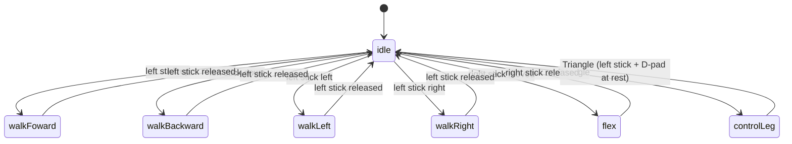

# Controls

All mappings below are read from `RPI/stateMachine.py` unless a section says otherwise.
Handlers are the `on_*` methods of `MyController`; `pyPS4Controller` calls them on every
event. Stick, D-pad and Triangle handlers only record inputs and the movement thread acts on
them; Circle, Square, X, L2 and R2 take effect immediately inside their handlers.

> **Naming clash:** the robot's legs are called L1 L2 L3 / R1 R2 R3, and the DualShock's
> shoulder buttons are also called L1 / R1 (with L2 / R2 the triggers and L3 / R3 the sticks).
> This page says "button" or "leg" every time it matters.

## The state machine

State names match the code, typo and all (`walkFoward`). The loop runs
every 0.06 s (~16 Hz). On entering `idle` all six legs are re-sent their current position.

## Stick behaviour

Raw stick values from `pyPS4Controller` are ±32767. The handlers divide by 10 000 and
ignore anything with magnitude ≤ 1, so roughly the inner 30 % of stick travel is dead zone.
Beyond that the value (1.0 – 3.3) is used directly as a multiplier where speed matters.

## Full button map

### Always active

| Input | Handler | Effect |
|---|---|---|
| D-pad ← | `on_left_arrow_press` | `speed -= 0.2`, floor 0.5 |
| D-pad → | `on_right_arrow_press` | `speed += 0.2`, ceiling 1.5 |
| Circle (press) | `on_circle_press` | Rebuild all six `Leg` objects at the idle stance and send them |
| Square (press) | `on_square_press` | Every foot `z += 70` (feet rise toward the body: body lowers). Repeat presses stack |
| X (press) | `on_x_press` | Every foot `z -= 70` (feet push down: body rises). Repeat presses stack |
| R2 trigger (press) | `on_R2_press` | Start PWM on GPIO 17 at 1 % duty ≈ pincer 0°. Press this once before L2 has any effect |
| L2 trigger (press) | `on_L2_press` | Set GPIO 17 duty to 12 % ≈ pincer 180° |
| Triangle (release) | `on_triangle_release` | Toggle the `triangle` flag (only while in `idle` or `controlLeg`); this switches into / out of single-leg mode |

`speed` starts at 0.75 and is only used by `flex` and `controlLeg`. Walking uses a fixed
gait step (`gait(..., 7, ...)`) that the sticks do not scale.

### From `idle`

| Input | Goes to |
|---|---|
| Left stick up | `walkFoward` |
| Left stick down | `walkBackward` |
| Left stick left | `walkLeft` |
| Left stick right | `walkRight` |
| Triangle | `controlLeg` |
| Right stick (any direction) | `flex` |

Checks happen in that order: the left stick beats Triangle, and Triangle beats the right stick.

### Walking (`walkFoward`, `walkBackward`, `walkLeft`, `walkRight`)

Hold the left stick; release it to return to `idle`. The feet stay wherever they were in the
stride (press Circle to reset them). Each state has its own set of
per-leg start and end points. Legs are split into two tripods that start half a cycle
apart:

| Tripod | Legs | Starting waypoint |
|---|---|---|
| A | L1, L3, R2 | `upperMid` (foot lifted) |
| B | R1, R3, L2 | `lowerMid` (foot on the ground) |

Every leg cycles `gaitEnd → lowerMid → gaitStart → upperMid → gaitEnd …`. `lowerMid` is the
plain midpoint of the stroke. `upperMid` is the same midpoint with `z` replaced by
`leveledZ + 50` = −10 (`leveledZ` is the constant −60 from `Leg.py`), so the foot lifts to z = −10.
A waypoint counts as reached when the foot is within 3 units of it.

### `flex` (right stick)

Tilts the body by raising some feet and lowering others. `V` is the vertical stick value,
`H` the horizontal, both scaled by `speed`:

| Leg | `z` change per tick |
|---|---|
| L1 | `+(V − H)` |
| R1 | `+(V + H)` |
| L3 | `−(V + H)` |
| R3 | `−(V − H)` |
| L2 | `−H` |
| R2 | `+H` |

Each leg's `z` is only updated while it would stay inside `(-110, -50)`. Releasing the
stick returns to `idle` (the legs stay where they are).

### `controlLeg` (single-leg mode)

Enter with Triangle from `idle`; leave with Triangle again while the left stick and D-pad ↑/↓
are at rest. The right stick is not checked here, but if it is deflected `idle` switches
straight into `flex`. The selected leg's index is printed to the terminal on every change.

| Input | Effect |
|---|---|
| L1 button (release) | Previous leg |
| R1 button (release) | Next leg |
| Left stick ↔ | Selected foot `x += H × speed` per tick |
| Left stick ↕ | Selected foot `z += V × speed` per tick |
| D-pad ↑ / ↓ (hold) | Selected foot `y += ±3 × speed` per tick |

Leg order for L1 / R1 cycling: `L1 → R1 → R3 → L3 → L2 → R2` (wraps). Starts on `L1`.

### Unused

Options, Share, PS button, L3 / R3 stick clicks, L1 / R1 outside `controlLeg`.

## `jumpTest.py`

Drives only legs L1, L3, R1, R3 (idle point `(0, 45, -70)`). Actions fire on button
*release*:

| Input | Effect |
|---|---|
| Square | All four legs to the idle stance |
| Circle | "Load": all four legs to `(0, 25, -54)` (crouch) |
| X | "Jump": all four legs to `(0, 40, -150)`, then automatically back to the load pose after 0.3 s |
| Circle / Square (press) | Nudge leg R1 `x` by ±5 |
| D-pad ← / → | `speed` −0.2 / +0.2, clamped 0.2 – 1.0 |

## `legacy/Controller.py`

The pre-`helperClasses` four-leg version (L1, L3, R1, R3), with limit switches on GPIO
17 / 22 / 23 / 25. Kept for reference.

| Input | Effect |
|---|---|
| Left stick ↔ / ↕ | Leg L1 `x` / `z` at `speed` |
| D-pad ↑ / ↓ | Leg R1 `z` ±5 |
| D-pad ← / → | Leg R1 `y` ±5 |
| Circle / Square | Leg R1 `x` ±5 |
| R2 / L2 trigger (release) | Leg R1 `x` ±5 |
| R1 button (hold) | Run the gait on all four legs; release stops and re-targets L1 to where it is |

`legacy/ControllerMac.py` is a single-leg variant with no `LEG:` field in its packets. It
targets an earlier firmware that is no longer in the repo: `micropython/main.py` rejects its packets
(`Servo command with no/unknown LEG:`) and `circuitpython/code.py` crashes on them (`KeyError: 'none'`).
